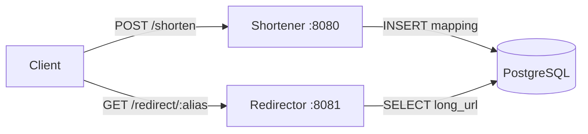

# URL Shortener


[](LICENSE)
[](https://goreportcard.com/report/github.com/MiguelGFerreira/UrlShortener)

A small URL shortener written in Go, split into two independent HTTP services backed by a shared PostgreSQL database:

- **Shortener** (`:8080`) — receives a long URL and returns a short alias.
- **Redirector** (`:8081`) — resolves a short alias and redirects to the original URL.

## Architecture



Both services share the data-access code in `internal/store` and the domain
type in `internal/model`, so the database logic lives in a single place.

## Project structure

```
.
├── shortener/        # POST /shorten — creates short aliases (:8080)
├── redirector/       # GET /redirect/{alias} — 301 redirect (:8081)
├── internal/
│   ├── model/        # URLMapping domain type
│   └── store/        # PostgreSQL connection + queries
├── schema.sql        # Database schema
└── .env.example      # Required environment variables
```

## Prerequisites

- [Go](https://go.dev/dl/) 1.18 or later
- A running [PostgreSQL](https://www.postgresql.org/) server

## Setup

1. **Clone the repository**

   ```bash
   git clone https://github.com/MiguelGFerreira/UrlShortener.git
   cd UrlShortener
   ```

2. **Install dependencies**

   ```bash
   go mod download
   ```

3. **Create the database and table**

   ```bash
   createdb url_shortener
   psql -d url_shortener -f schema.sql
   ```

4. **Configure credentials**

   Copy the example file and fill in your PostgreSQL credentials:

   ```bash
   cp .env.example .env
   ```

   | Variable  | Description                | Example    |
   | --------- | -------------------------- | ---------- |
   | `DB_USER` | PostgreSQL username        | `postgres` |
   | `DB_PASS` | PostgreSQL user's password | `secret`   |

   > The database name (`url_shortener`) and `localhost` host are currently
   > hardcoded in `internal/store`.

## Running

Start each service in its own terminal:

```bash
go run ./shortener    # listens on :8080
go run ./redirector   # listens on :8081
```

## Usage

**Shorten a URL** — send a `POST` to `/shorten`:

```bash
curl -s -X POST http://localhost:8080/shorten \
  -H "Content-Type: application/json" \
  -d '{"long_url": "https://example.com/some/very/long/path"}'
```

Response:

```json
{ "short_url": "http://localhost:8081/redirect/Ab3xZ9" }
```

**Follow a short URL** — open the returned link in a browser, or:

```bash
curl -i http://localhost:8081/redirect/Ab3xZ9
# HTTP/1.1 301 Moved Permanently
# Location: https://example.com/some/very/long/path
```

## Roadmap

Ideas for extending the project:

- [ ] Input validation for submitted URLs (scheme/format checks)
- [ ] Custom aliases chosen by the user
- [ ] Click statistics per short URL
- [ ] Link expiration (TTL) and deletion
- [ ] Rate limiting on `/shorten`
- [ ] Redis cache in front of the redirect lookup
- [ ] A small HTML front-end for shortening from the browser
- [ ] Dockerfile + docker-compose (app + PostgreSQL)
- [ ] Unit tests and CI

## License

Released under the [MIT License](LICENSE).
