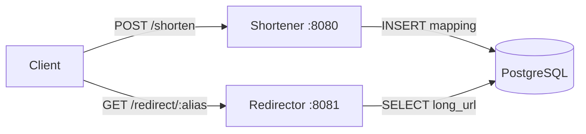

# URL Shortener

[](https://github.com/MiguelGFerreira/UrlShortener/actions/workflows/ci.yml)


[](LICENSE)
[](https://goreportcard.com/report/github.com/MiguelGFerreira/UrlShortener)

A small URL shortener written in Go, split into two independent HTTP services backed by a shared PostgreSQL database:

- **Shortener** (`:8080`) — receives a long URL and returns a short alias.
- **Redirector** (`:8081`) — resolves a short alias and redirects to the original URL.

## Architecture



Both services share the data-access code in `internal/store` and the domain
type in `internal/model`, so the database logic lives in a single place.

## Project structure

```
.
├── shortener/        # POST /shorten — creates short aliases (:8080)
├── redirector/       # GET /redirect/{alias} — 301 redirect (:8081)
├── internal/
│   ├── model/        # URLMapping domain type
│   └── store/        # PostgreSQL connection + queries
├── schema.sql        # Database schema
└── .env.example      # Required environment variables
```

## Prerequisites

- [Go](https://go.dev/dl/) 1.18 or later
- A running [PostgreSQL](https://www.postgresql.org/) server

## Setup

1. **Clone the repository**

   ```bash
   git clone https://github.com/MiguelGFerreira/UrlShortener.git
   cd UrlShortener
   ```

2. **Install dependencies**

   ```bash
   go mod download
   ```

3. **Create the database and table**

   ```bash
   createdb url_shortener
   psql -d url_shortener -f schema.sql
   ```

4. **Configure credentials**

   Copy the example file and fill in your PostgreSQL credentials:

   ```bash
   cp .env.example .env
   ```

   | Variable     | Description         | Default         |
   | ------------ | ------------------- | --------------- |
   | `DB_USER`    | PostgreSQL username | `postgres`      |
   | `DB_PASS`    | PostgreSQL password | _(empty)_       |
   | `DB_HOST`    | PostgreSQL host     | `localhost`     |
   | `DB_PORT`    | PostgreSQL port     | `5432`          |
   | `DB_NAME`    | Database name       | `url_shortener` |
   | `DB_SSLMODE` | libpq SSL mode      | `disable`       |

   > Only `DB_USER`/`DB_PASS` are usually needed; the rest have sensible
   > defaults for local development.

## Run with Docker

The quickest way to get everything running — PostgreSQL plus both services — is
Docker Compose. It creates the database, applies `schema.sql`, and starts all
three containers (no manual database setup needed):

```bash
docker compose up --build
```

- Shortener → http://localhost:8080
- Redirector → http://localhost:8081

Credentials default to `postgres`/`postgres`; override them with a `.env` file
(see `.env.example`) before starting. Tear everything down, including the
database volume, with:

```bash
docker compose down -v
```

## Run locally

With the database created and `.env` configured (see [Setup](#setup)), start
each service in its own terminal:

```bash
go run ./shortener    # listens on :8080
go run ./redirector   # listens on :8081
```

## Usage

**Shorten a URL** — send a `POST` to `/shorten`:

```bash
curl -s -X POST http://localhost:8080/shorten \
  -H "Content-Type: application/json" \
  -d '{"long_url": "https://example.com/some/very/long/path"}'
```

Response:

```json
{ "short_url": "http://localhost:8081/redirect/Ab3xZ9" }
```

> `long_url` must be a valid `http`/`https` URL; otherwise the service responds
> with `400 Bad Request`.

**Custom alias** — optionally include an `alias` (3–16 chars: letters, digits,
`-` or `_`) to pick your own short code:

```bash
curl -s -X POST http://localhost:8080/shorten \
  -H "Content-Type: application/json" \
  -d '{"long_url": "https://example.com", "alias": "my-link"}'
```

If the alias is already in use, the service responds with `409 Conflict`.

**Follow a short URL** — open the returned link in a browser, or:

```bash
curl -i http://localhost:8081/redirect/Ab3xZ9
# HTTP/1.1 301 Moved Permanently
# Location: https://example.com/some/very/long/path
```

> Each visit increments the alias's click counter.

**Statistics** — inspect usage for an alias via `/stats/{alias}`:

```bash
curl -s http://localhost:8080/stats/my-link
```

```json
{
  "short_url": "my-link",
  "long_url": "https://example.com",
  "clicks": 3,
  "created_at": "2026-06-26T12:00:00Z",
  "last_accessed_at": "2026-06-26T12:34:56Z"
}
```

**Health check** — each service exposes `/health`, returning `200 ok` while its
database connection is alive (and `503` otherwise):

```bash
curl -i http://localhost:8080/health   # shortener
curl -i http://localhost:8081/health   # redirector
```

## Roadmap

Ideas for extending the project:

- [x] Input validation for submitted URLs (scheme/format checks)
- [x] `/health` endpoint on both services
- [x] Custom aliases chosen by the user
- [x] Click statistics per short URL
- [ ] Link expiration (TTL) and deletion
- [ ] Rate limiting on `/shorten`
- [ ] Redis cache in front of the redirect lookup
- [ ] A small HTML front-end for shortening from the browser
- [x] Dockerfile + docker-compose (app + PostgreSQL)
- [x] Unit tests and CI

## License

Released under the [MIT License](LICENSE).
